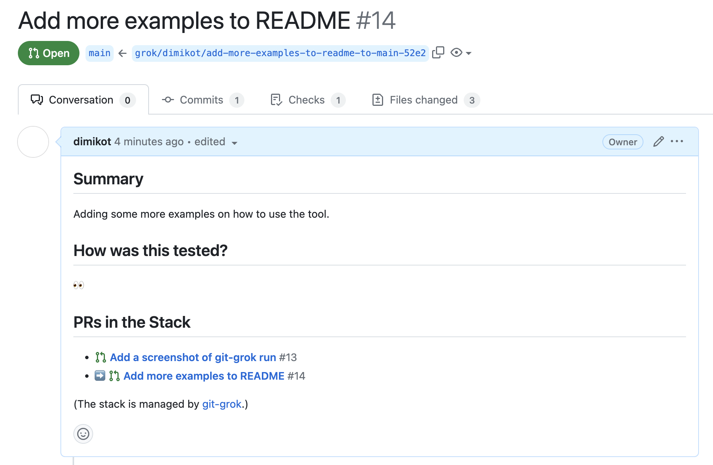

# Git-grok: stacked PRs and stacked diffs for GitHub

Git-grok is the simplest stacked commits (stacked PRs, stacked diffs — you name
it) solution for GitHub.

One idempotent command to rule 'em all:

```bash
git grok
```

No arguments. No configuration. No interactivity.

You don't need to learn a separate Git UI: continue running Git in console if
you want, or use your favorite tools (like VSCode's Git panel).

## Stacked PRs

If you frequently write code and find it tedious to manage interdependent
branches (like when "branch A depends on branch B which itself depends on branch
C"), there's an approach that avoids the use of branches entirely. This method,
known as "stacked PRs", is used in Meta, Google and other leading companies.

The central idea is that every individual commit in your local working copy
becomes an individual pull request. Commits can be stacked on top of each other,
reordered, and edited right on your computer using the standard Git features.
Then, run `git-grok` to sync the changes in local commits out to their
corresponding PRs at GitHub.

When you want to make changes based on feedback in some PR, just "jump into" the
local commit in your stack, make the change ("edit a commit in the middle of the
stack"), and rerun `git grok` to get it propagated to the PRs at GitHub.

Want to reorder the commits to merge the approved one before another? Do it
locally and run `git grok`.


The guy above hints that stacked PRs workflow is incredibly sticky, although it
has some learning curve. (It's not the workflow that has the curve, but Git
itself.) Try using `git-grok` for a week, and you'll never get back. This is a
one way road.

## Installation

```bash
git clone https://github.com/dimikot/git-grok.git
sudo ln -s $(pwd)/git-grok/git-grok /usr/local/bin/git-grok

brew install gh
gh auth login
```

> [!IMPORTANT]
> Don't forget to run `gh auth login`, it won't work otherwise.

## Usage Examples

```bash
cd your-repository
git pull

# Create a PR from the topmost commit you've just made.
touch commit1
git add . && git commit -m "Some commit"
git grok

# Create more commits on top of each other, all on top of main.
touch commit2
git add . && git commit -m "Add more examples to README"
touch commit3
git add . && git commit -m "Add a screenshot of git-grok run"

# This turns each individual commit on top of main into individual PRs
# (one commit = one PR) and keeps the PRs in sync with local commits.
git grok
```


Now comes the beauty of stacked PRs workflow. At any time you can edit a local
commit in the middle of the stack in your working copy and rerun `git grok` to
update all the PRs automatically:

```bash
git rebase -i
# Now choose a commit which you want to edit. Edit the code, then run:
git add .
git commit --amend
git rebase --continue

# This auto-updates all of the related PRs, so they will be in sync with
# your local working copy.
git grok
```

You can also reorder the commits freely in case a PR in the middle got accepted
earlier than the previous one, and you want to merge it now. As usual, `git
rebase -i`, reorder, run `git grok`.

With stacked PRs workflow, there is no need in branches and `git push` anymore.

Here is how a pull request managed by `git-grok` looks like. Notice the block
"PRs in the Stack" at the bottom of the description: it's added by the tool
automatically, and it will also be kept in sync with your stack of local commits
as you go. (It is also fully compatible with pull_request_template.md GitHub
feature in case you use it.)



## How to Merge

If your repository enforces code reviews on the main branch (so the only way to
push there is through GitHub UI), the process is following.

You "Create a merge commit" or "Squash and merge" or "Rebase and merge" the 1st
PR in the stack by clicking the button in GitHub UI (it will go to the main
branch).

Then, after the PR is merged, GitHub is smart enough to update the base of the
next PR in the stack to point to the main branch (hooray!). So you just click on
the 2nd PR in the stack and merge it.

Rinse.

Repeat.

Warning: pay attention to only merge (or rebase) into the main branch in GitHub
UI. GitHub is smart, so it automatically changes the base of the next PR to main
once its old branch is auto-deleted when you merge, but if you see something
unusual, just rerun `git pull --rebase && git grok`

## Most Magic is Provided by GitHub and Git...

To demystify `git-grok`, it's worth pointing out a list of things that it does
**not** do:

1. It does not create commits.
2. It does not modify commits code nor anyhow change the Git tree.
3. It does not merge pull requests. Does not close PRs.
4. It does not pull.
5. It does not produce merge conflicts.
6. It does not add reviewers to the PRs.
7. It does not modify PR title and description.

All of the above is done by either Git or GitHub.

**What `git-grok` does:** is continuously ensures that each 1 existing local
commit has 1 corresponding and up-to-date PR on GitHub. In that direction. Not
more, not less.

## What if my GitHub Actions are slow, so they take minutes to execute?

(First of all, you'd better make them fast, because you're wasting the
time/money of the entire company otherwise.)

But if you cannot, and you want to use "Squash and merge" or "Rebase and merge"
button with stacked PRs, I have bad news for you. When you merge a bottom PR in
the stack using any of those two options (note: the 3rd option, "Create a merge
commit", works fine), you'll have to wait until GitHub Actions finish running
the checks for all other PRs above. It's a GitHub limitation.

There are 2 workarounds here though:

1. **Recommended: use "Create a merge commit" option on the PR button.** It
   doesn't have this problem with re-running GitHub Actions checks when some
   bottom PR gets merged.
2. If you don't want merge commits, and you ran `git pull --rebase` before `git
   grok`, and all GitHub Actions checks in all PRs have succeeded, and there are
   no other commits added on top of the main branch by someone else... then, you
   can merge the entire stack from your local machine with the following
   snippet:
   ```bash
   for c in $(git log --reverse --pretty=format:%h origin/main...HEAD); do
     git push origin $c:main
     sleep 5
   done
   ```
   Notice that "Squash and merge"/"Rebase and merge" button in GitHub UI won't
   work in this case still, because it amends the commit message implicitly, so
   it will still rerun the checks for the PRs above.
